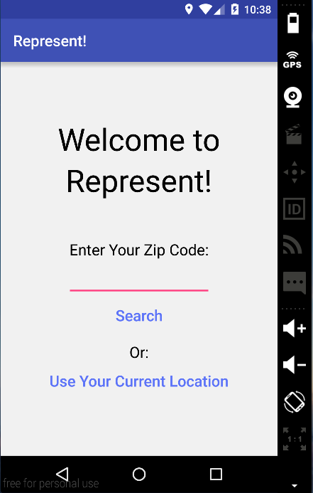
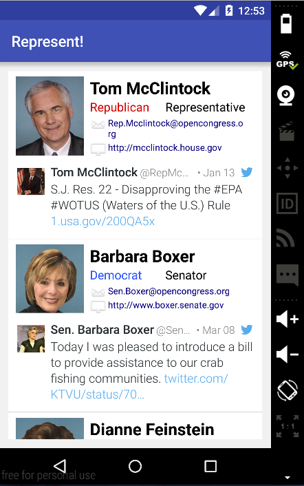
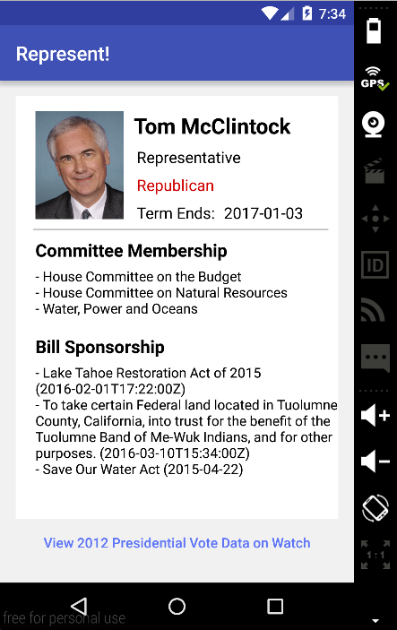
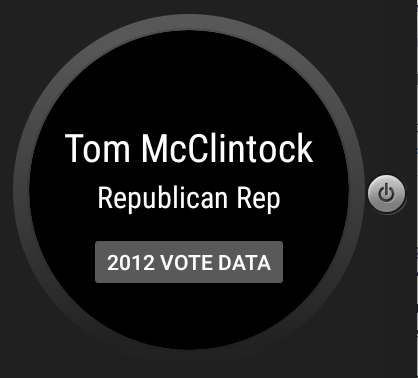
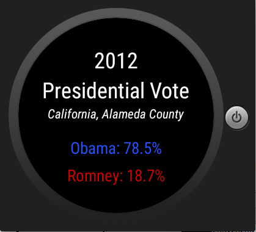

# PROG 02: Represent!

Represent! is an Android mobile and wear app that allows users to look up senators and representatives of different regions and check the 2012 presidential election data. It utilizes the Sunlight API, Fabric for Android, and Google Map Geocoding API.

## Authors

Jenny Chen ([jenny0322@berkeley.edu](mailto:jenny0322@berkeley.edu))

## Demo Video

See [[CS160 Sp16] Represent! App Demo] (https://youtu.be/v8YlPmme95Y)

## Screenshots
Mobile
&nbsp;&nbsp;&nbsp;&nbsp;
&nbsp;&nbsp;&nbsp;&nbsp;

 Wear

## Acknowledgments

* StackOverflow 
* Piazza
